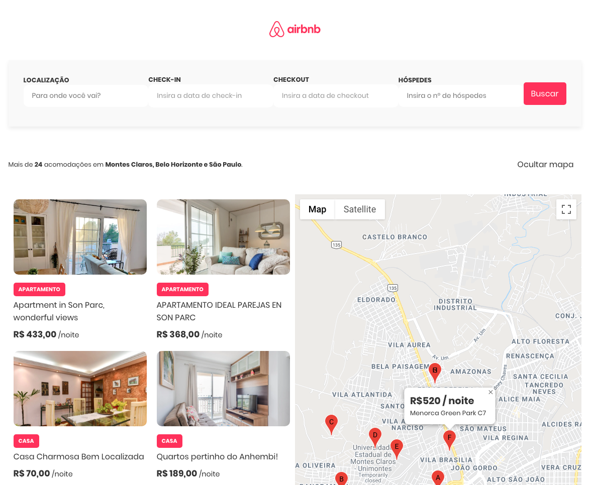

# Gama Academy - Desafio: Quartos do Airbnb

## Sobre o desafio
Criar uma página similar ao site **Airbnb** utilizando CSS, HTML e JavaScript.

## Funcionalidades
- Listagem de quartos utilizando a API fornecida;
- Paginação para a listagem de todos os quartos;
- API do Google Maps exibindo o pin de cada quarto;
- Cálculo do valor total por estadia ao utilizar filtro.

## Habilidades aprendidas e/ou treinadas
- Operações com arrays (map, filter, reduce);
- Manipulação da API do Google Maps;
- Consumo da API utilizando fetch;
- Criação de Paginação;
- Criação de conteúdo no DOM via JavaScript.

## Demo
Nesta versão, a busca está limitada apenas para as cidades: Montes Claros, Belo Horizonte e São Paulo.

[Link para a Demo](https://quartos-airbnb.netlify.app)

